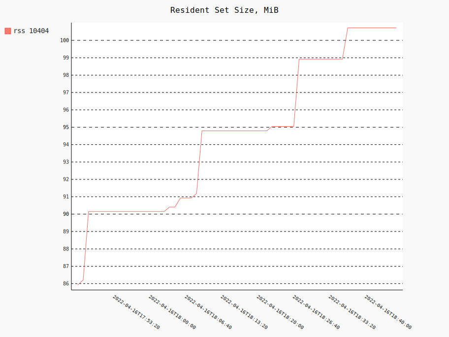

Leaker demonstrates how Jaffree leaks memory using FrameConsumer. Modify main
method of Leaker class to point to video stream. Also set loop to number of
seconds to run. [Procpath](https://pypi.org/project/Procpath) can be used to
track memory usage by pid.

